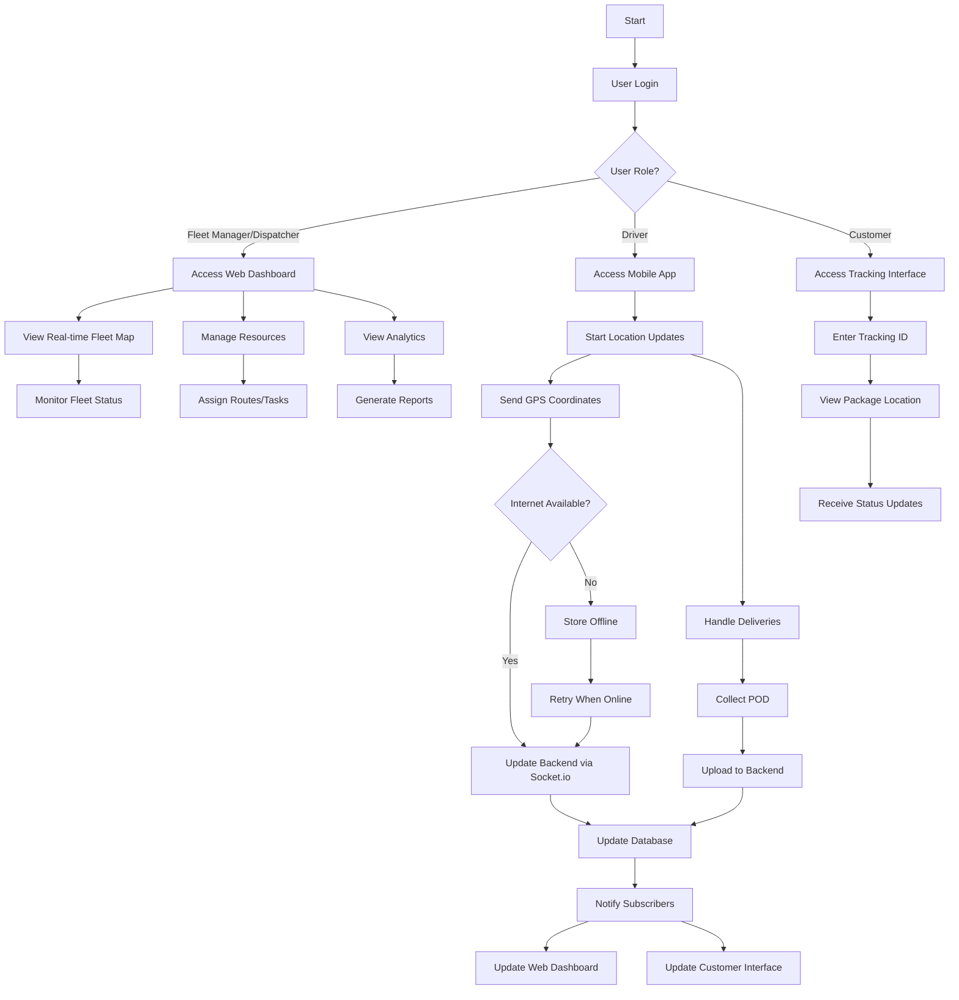
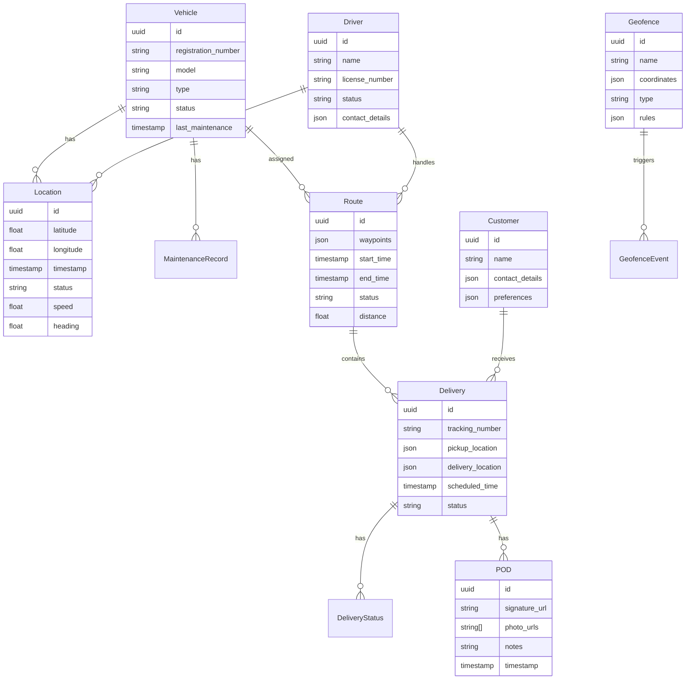
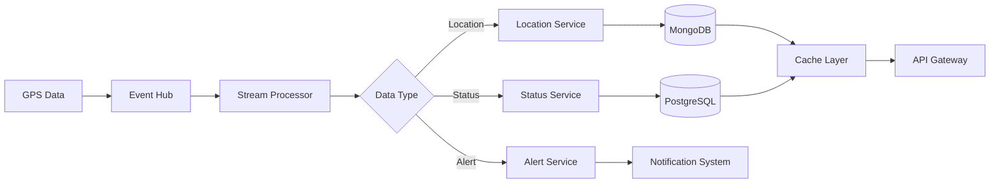
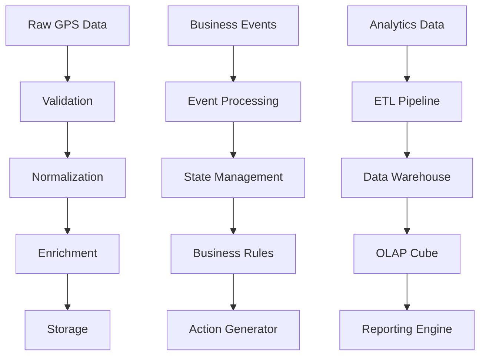
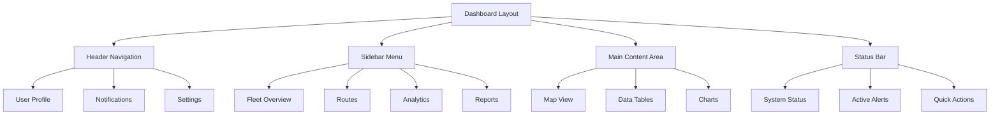
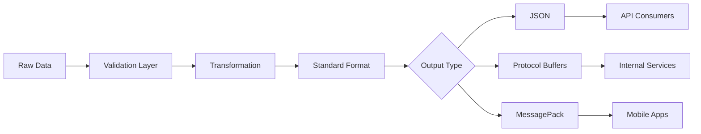

# 1. Introduction

## 1.1 Purpose

This Software Requirements Specification (SRS) document provides a comprehensive description of the Live Fleet Tracking System implementation requirements. It serves as the primary reference for technical teams, stakeholders, and project managers involved in the development process. The document details functional and non-functional requirements, system interfaces, and performance specifications that will guide the development team in building a solution that meets all stakeholder needs.

## 1.2 Scope

The Live Fleet Tracking System is a cloud-based solution built on a microservices architecture that enables real-time fleet monitoring and management. The system encompasses:

- Real-time GPS tracking with 30-second update intervals
- Web-based fleet management dashboard using React
- Mobile applications for drivers built with React Native
- Customer-facing tracking interfaces
- Backend services powered by Node.js and Python
- Data storage using PostgreSQL and MongoDB
- Integration capabilities via RESTful APIs and webhooks
- Real-time communication through Socket.io and WebSocket protocols

Key benefits include:
- Enhanced visibility into delivery operations
- Improved fleet utilization and resource allocation
- Reduced operational costs through route optimization
- Increased customer satisfaction through transparent delivery tracking
- Streamlined communication between drivers, dispatchers, and customers

The system will support multiple user roles including fleet managers, dispatchers, drivers, package senders, recipients, and system administrators, each with role-specific interfaces and functionality.

# 2. Product Description

## 2.1 Product Perspective
The Live Fleet Tracking System operates as a cloud-based SaaS solution within the broader logistics and supply chain ecosystem. The system interfaces with:

- External mapping services through Google Maps Platform
- Third-party traffic data providers
- E-commerce platforms via API integrations
- Warehouse Management Systems (WMS)
- Enterprise Resource Planning (ERP) systems
- Mobile device GPS and sensor systems
- SMS and push notification services

## 2.2 Product Functions
The system provides the following core functions:

- Real-time GPS vehicle tracking with 30-second updates
- Interactive fleet management dashboard
- Dynamic route optimization and ETA calculations
- Geofence creation and monitoring
- Digital proof of delivery collection
- Automated status updates and notifications
- Performance analytics and reporting
- Two-way communication between stakeholders
- Historical route replay and analysis
- Resource allocation and scheduling
- Maintenance tracking and alerts

## 2.3 User Characteristics

| User Type | Technical Expertise | Primary Functions | Access Method |
|-----------|-------------------|-------------------|---------------|
| Fleet Managers | Moderate | Fleet oversight, resource allocation, analytics review | Web dashboard |
| Dispatchers | Moderate | Route planning, driver assignment, real-time monitoring | Web dashboard |
| Drivers | Basic | Status updates, navigation, delivery management | Mobile app |
| Package Senders | Basic to Advanced | Shipment tracking, analytics, integration management | Web dashboard, API |
| Package Recipients | Basic | Package tracking, delivery preferences, communication | Web/mobile interface |
| System Administrators | Advanced | System configuration, user management, maintenance | Web dashboard |

## 2.4 Constraints

Technical Constraints:
- Mobile device battery consumption limitations
- Network connectivity requirements for real-time updates
- GPS accuracy limitations in urban environments
- Mobile platform compatibility requirements (iOS 12+ and Android 8+)
- Database scalability limits based on chosen infrastructure

Regulatory Constraints:
- Data privacy compliance (GDPR, CCPA)
- Electronic logging device (ELD) regulations
- Local transportation authority requirements
- Data retention policies
- Cross-border data transfer restrictions

Business Constraints:
- Initial development budget of $1.5M
- 12-month development timeline
- Support for minimum 10,000 concurrent users
- Maximum 5% system downtime
- 24/7 support requirements

## 2.5 Assumptions and Dependencies

Assumptions:
- Users have access to modern web browsers and mobile devices
- Stable internet connectivity in primary operation areas
- GPS functionality available on all tracking devices
- Basic technical literacy among all user types
- Availability of accurate traffic data

Dependencies:
- Google Maps Platform services and API
- Cloud infrastructure availability (AWS/Azure/GCP)
- Third-party notification services
- Mobile platform app stores
- External data providers for traffic and weather
- Integration partners' API stability
- GPS satellite system functionality
- Cellular network coverage in operation areas

# 3. Functional Requirements

## 3.1 Real-Time Location Tracking

### F1: GPS Location Updates
**ID**: F1.1  
**Description**: Continuous collection and transmission of vehicle GPS coordinates  
**Priority**: High  

| Requirement ID | Requirement Description | Input | Output |
|---------------|------------------------|--------|---------|
| F1.1.1 | System shall collect GPS coordinates every 30 seconds | GPS data from mobile device | Latitude/longitude coordinates |
| F1.1.2 | System shall transmit location data via Socket.io | Location data packet | Confirmation of data receipt |
| F1.1.3 | System shall store offline location data when connectivity is lost | GPS coordinates | Cached location data |
| F1.1.4 | System shall batch upload stored locations when connectivity resumes | Cached location data | Sync confirmation |

### F2: Geofencing
**ID**: F2.1  
**Description**: Creation and monitoring of virtual geographic boundaries  
**Priority**: Medium  

| Requirement ID | Requirement Description | Input | Output |
|---------------|------------------------|--------|---------|
| F2.1.1 | System shall support circular and polygon geofence creation | Coordinate sets, radius | Geofence object |
| F2.1.2 | System shall detect geofence entry/exit events | Vehicle location | Entry/exit notification |
| F2.1.3 | System shall trigger automated alerts for unauthorized zone departures | Zone violation event | Alert notification |
| F2.1.4 | System shall log all geofence events | Geofence event data | Event log entry |

## 3.2 Fleet Management Dashboard

### F3: Vehicle Monitoring
**ID**: F3.1  
**Description**: Real-time fleet visibility and status monitoring  
**Priority**: High  

| Requirement ID | Requirement Description | Input | Output |
|---------------|------------------------|--------|---------|
| F3.1.1 | System shall display all vehicle locations on interactive map | Vehicle location data | Map visualization |
| F3.1.2 | System shall show vehicle status indicators | Vehicle status data | Status display |
| F3.1.3 | System shall provide fleet-wide statistics | Fleet operational data | Statistical dashboard |
| F3.1.4 | System shall enable filtering and searching of vehicles | Search/filter criteria | Filtered vehicle list |

### F4: Route Management
**ID**: F4.1  
**Description**: Dynamic route planning and optimization  
**Priority**: High  

| Requirement ID | Requirement Description | Input | Output |
|---------------|------------------------|--------|---------|
| F4.1.1 | System shall calculate optimal routes based on multiple factors | Delivery locations, traffic data | Optimized route |
| F4.1.2 | System shall provide real-time ETA calculations | Current location, route data | Updated ETA |
| F4.1.3 | System shall support manual route adjustments | Route modification input | Updated route |
| F4.1.4 | System shall track route adherence | Actual vs planned route | Adherence report |

## 3.3 Mobile Driver Application

### F5: Driver Interface
**ID**: F5.1  
**Description**: Mobile application for delivery management  
**Priority**: High  

| Requirement ID | Requirement Description | Input | Output |
|---------------|------------------------|--------|---------|
| F5.1.1 | System shall provide turn-by-turn navigation | Route data | Navigation instructions |
| F5.1.2 | System shall enable status updates with one tap | Status selection | Status update confirmation |
| F5.1.3 | System shall support digital proof of delivery | Photo, signature, notes | POD confirmation |
| F5.1.4 | System shall allow offline operation | Delivery data | Cached updates |

### F6: Communication
**ID**: F6.1  
**Description**: In-app messaging and notification system  
**Priority**: Medium  

| Requirement ID | Requirement Description | Input | Output |
|---------------|------------------------|--------|---------|
| F6.1.1 | System shall support two-way messaging with dispatch | Message content | Message delivery confirmation |
| F6.1.2 | System shall send automated status notifications | Status change | Push notification |
| F6.1.3 | System shall allow emergency alert broadcasting | Emergency message | Alert notification |
| F6.1.4 | System shall maintain message history | Message data | Message log |

## 3.4 Customer Tracking Interface

### F7: Package Tracking
**ID**: F7.1  
**Description**: Customer-facing delivery tracking interface  
**Priority**: High  

| Requirement ID | Requirement Description | Input | Output |
|---------------|------------------------|--------|---------|
| F7.1.1 | System shall provide real-time package location | Tracking ID | Location display |
| F7.1.2 | System shall display delivery status timeline | Delivery events | Status timeline |
| F7.1.3 | System shall show dynamic ETA updates | Current delivery data | Updated ETA |
| F7.1.4 | System shall enable delivery preference updates | Customer preferences | Preference confirmation |

### F8: Analytics and Reporting
**ID**: F8.1  
**Description**: Performance metrics and analytical tools  
**Priority**: Medium  

| Requirement ID | Requirement Description | Input | Output |
|---------------|------------------------|--------|---------|
| F8.1.1 | System shall generate delivery performance reports | Delivery data | Performance report |
| F8.1.2 | System shall track fleet utilization metrics | Fleet activity data | Utilization report |
| F8.1.3 | System shall provide driver efficiency analysis | Driver performance data | Efficiency metrics |
| F8.1.4 | System shall calculate fuel consumption statistics | Fuel usage data | Consumption report |

# 4. Non-Functional Requirements

## 4.1 Performance Requirements

| Requirement | Specification | Measurement Method |
|------------|---------------|-------------------|
| Response Time | Web dashboard response < 200ms | Server-side monitoring |
| Location Update Latency | < 1 second from device to server | End-to-end timing logs |
| API Throughput | 1000 requests/second per service | Load testing metrics |
| Database Query Time | < 100ms for 95% of queries | Query performance monitoring |
| Mobile App Launch Time | < 3 seconds on 4G networks | Mobile analytics |
| Memory Usage | < 100MB for mobile app | Device resource monitoring |
| Battery Consumption | < 5% per hour of active use | Mobile power profiling |
| Map Rendering Time | < 2 seconds for initial load | Frontend performance metrics |

## 4.2 Safety Requirements

| Requirement | Description | Implementation |
|------------|-------------|----------------|
| Data Backup | Hourly incremental, daily full backups | Automated backup systems |
| Failover System | Active-active redundancy across regions | Load balancer configuration |
| Error Recovery | Automatic system recovery within 30 seconds | Health check monitoring |
| Data Loss Prevention | Maximum 30 seconds of data loss in failures | Write-ahead logging |
| Offline Operation | Essential functions available without connectivity | Local data storage |
| Emergency Protocols | Automated alerts for critical system failures | Monitoring and alerting |
| Audit Logging | Complete audit trail of system operations | Centralized log management |

## 4.3 Security Requirements

| Requirement | Specification | Implementation |
|------------|---------------|----------------|
| Authentication | Multi-factor authentication for all users | OAuth 2.0 + TOTP |
| Authorization | Role-based access control (RBAC) | JWT with role claims |
| Data Encryption | AES-256 for data at rest, TLS 1.3 in transit | Encryption libraries |
| API Security | Rate limiting, JWT authentication | API gateway |
| Session Management | 24-hour token expiry, secure cookie handling | Session middleware |
| Password Policy | Minimum 12 characters, complexity requirements | Password validation |
| Security Monitoring | Real-time threat detection and prevention | SIEM integration |
| Data Privacy | Data anonymization and pseudonymization | Privacy-preserving algorithms |

## 4.4 Quality Requirements

### 4.4.1 Availability
- System uptime: 99.9% excluding planned maintenance
- Maximum planned downtime: 4 hours per month
- Recovery Time Objective (RTO): 15 minutes
- Recovery Point Objective (RPO): 30 seconds

### 4.4.2 Maintainability
- Code coverage: Minimum 80%
- Documentation: Updated within 24 hours of changes
- Deployment frequency: Weekly releases
- Mean Time To Repair (MTTR): < 30 minutes

### 4.4.3 Usability
- Learning curve: < 2 hours for basic operations
- Error rate: < 1% for common tasks
- Help documentation: Available in-app
- Accessibility: WCAG 2.1 Level AA compliance

### 4.4.4 Scalability
- Horizontal scaling: Up to 100 service instances
- User capacity: 10,000 concurrent users
- Data growth: 1TB per month
- Load balancing: Automatic scaling based on CPU usage

### 4.4.5 Reliability
- Mean Time Between Failures (MTBF): > 720 hours
- Error rate: < 0.1% for all transactions
- Data integrity: 100% consistency check
- Fault tolerance: No single point of failure

## 4.5 Compliance Requirements

| Requirement | Standard/Regulation | Implementation |
|------------|-------------------|----------------|
| Data Protection | GDPR, CCPA | Privacy controls, data handling procedures |
| Transportation | DOT, FMCSA regulations | ELD compliance, hours of service tracking |
| Security Standards | ISO 27001, SOC 2 | Security controls, audit procedures |
| Accessibility | WCAG 2.1 | Accessible interface design |
| Environmental | EPA SmartWay | Carbon footprint tracking |
| Industry Standards | OpenAPI 3.0, REST | API design and documentation |
| Data Retention | Industry-specific regulations | Automated retention policies |
| Cross-border Data | Data localization laws | Regional data storage |

# 5. Data Requirements

## 5.1 Data Models

## 5.2 Data Storage

### 5.2.1 Primary Storage Systems
- PostgreSQL for relational data (vehicles, drivers, customers)
- MongoDB for location data and real-time tracking events
- Redis for caching and real-time data processing

### 5.2.2 Data Retention
- Real-time location data: 90 days in primary storage
- Historical location data: 3 years in cold storage
- Delivery records: 7 years
- Customer data: Duration of account plus 2 years
- System logs: 1 year

### 5.2.3 Backup and Recovery
- Automated hourly incremental backups
- Daily full backups to geographically distributed locations
- Point-in-time recovery capability up to 30 days
- Cross-region replication with 3 copies minimum
- Maximum 15-minute Recovery Time Objective (RTO)
- 30-second Recovery Point Objective (RPO)

### 5.2.4 Data Scalability
- Horizontal sharding for location data
- Partitioning by date for historical records
- Read replicas for analytics workloads
- Automated archive policy for cold storage
- Elastic scaling based on storage utilization

## 5.3 Data Processing

### 5.3.1 Real-time Processing Pipeline

### 5.3.2 Data Security
- AES-256 encryption for data at rest
- TLS 1.3 for data in transit
- Field-level encryption for sensitive data
- Data masking for non-privileged users
- Automated data classification system
- Access audit logging
- GDPR/CCPA compliance controls

### 5.3.3 Data Transformation

### 5.3.4 Data Integration
- REST API endpoints for external systems
- Webhook support for event notifications
- Batch processing for historical data
- Real-time streaming via WebSocket/Socket.io
- ETL pipelines for analytics
- Message queues for asynchronous processing

# 6. External Interfaces

## 6.1 User Interfaces

### 6.1.1 Web Dashboard Interface
- Built using React with Material-UI components
- Responsive design supporting 1024x768 minimum resolution
- Dark/light theme support
- Accessibility compliance with WCAG 2.1 Level AA
- Multi-language support (English, Spanish, French)

### 6.1.2 Mobile Driver App Interface
- React Native implementation
- Support for iOS 12+ and Android 8+
- Portrait and landscape orientation support
- Offline-first design
- High-contrast mode for daylight visibility

### 6.1.3 Customer Tracking Interface
- Progressive Web App (PWA)
- Mobile-responsive design
- Minimal UI for quick loading
- Support for embedded iframe integration

## 6.2 Hardware Interfaces

### 6.2.1 Mobile Device Sensors
| Sensor Type | Requirements | Data Format |
|-------------|--------------|-------------|
| GPS | Minimum accuracy of 10 meters | NMEA 0183 |
| Accelerometer | 100Hz sampling rate | JSON structured data |
| Gyroscope | 100Hz sampling rate | JSON structured data |
| Camera | Minimum 5MP resolution | JPEG/PNG format |

### 6.2.2 Vehicle Telematics
| Interface | Protocol | Data Points |
|-----------|----------|-------------|
| OBD-II | SAE J1939 | Engine data, fuel level, odometer |
| CAN Bus | ISO 15765-2 | Vehicle status, diagnostic codes |
| Temperature Sensors | 1-Wire | Cargo temperature monitoring |

## 6.3 Software Interfaces

### 6.3.1 External Services Integration

| Service | Interface Type | Protocol | Data Format |
|---------|---------------|----------|-------------|
| Google Maps Platform | REST API | HTTPS | JSON |
| Weather Services | REST API | HTTPS | JSON |
| Traffic Data Providers | REST API | HTTPS | JSON |
| SMS Gateway | REST API | HTTPS | JSON |
| Push Notification Service | REST API | HTTPS | JSON |

### 6.3.2 Enterprise System Integration

| System | Integration Method | Protocol | Authentication |
|--------|-------------------|----------|----------------|
| WMS | REST API/Webhooks | HTTPS | OAuth 2.0 |
| ERP | REST API/Webhooks | HTTPS | OAuth 2.0 |
| CRM | REST API | HTTPS | API Key |
| Accounting Software | REST API | HTTPS | OAuth 2.0 |

## 6.4 Communication Interfaces

### 6.4.1 Real-time Communication

| Protocol | Use Case | Format | Security |
|----------|----------|--------|----------|
| Socket.io | Location updates | JSON | TLS 1.3 |
| WebSocket | Status updates | Binary | TLS 1.3 |
| MQTT | Sensor data | Binary | TLS 1.3 |
| Server-Sent Events | Notifications | JSON | TLS 1.3 |

### 6.4.2 API Communication

| Endpoint Type | Protocol | Format | Rate Limit |
|---------------|----------|--------|------------|
| REST API | HTTPS | JSON | 1000 req/min |
| GraphQL | HTTPS | JSON | 100 req/min |
| Webhooks | HTTPS | JSON | 100 req/min |
| Batch API | HTTPS | JSON | 10 req/min |

### 6.4.3 Data Exchange Formats

# APPENDICES

## A.1 Glossary

| Term | Definition |
|------|------------|
| Geofence | A virtual perimeter defined by GPS coordinates for a real-world geographic area |
| Proof of Delivery (POD) | Digital confirmation of successful delivery including photos, signatures, and notes |
| Cold Storage | Long-term data storage system optimized for infrequently accessed data |
| Write-ahead Logging | Database recovery mechanism that logs changes before applying them to the database |
| Recovery Time Objective (RTO) | Maximum acceptable time for system recovery after failure |
| Recovery Point Objective (RPO) | Maximum acceptable amount of data loss measured in time |
| Sharding | Database partitioning technique that splits data across multiple servers |
| ETL | Extract, Transform, Load - process of combining data from multiple sources |
| OLAP | Online Analytical Processing - technology for complex data analysis |

## A.2 Acronyms

| Acronym | Full Form |
|---------|-----------|
| RBAC | Role-Based Access Control |
| TOTP | Time-based One-Time Password |
| SIEM | Security Information and Event Management |
| WCAG | Web Content Accessibility Guidelines |
| DOT | Department of Transportation |
| FMCSA | Federal Motor Carrier Safety Administration |
| ELD | Electronic Logging Device |
| NMEA | National Marine Electronics Association |
| OBD | On-Board Diagnostics |
| CAN | Controller Area Network |
| WMS | Warehouse Management System |
| ERP | Enterprise Resource Planning |
| CRM | Customer Relationship Management |
| MQTT | Message Queuing Telemetry Transport |

## A.3 Additional References

| Reference | Description | URL |
|-----------|-------------|-----|
| Socket.io Documentation | Real-time event-based communication | https://socket.io/docs/ |
| React Native Documentation | Mobile application framework | https://reactnative.dev/docs |
| Google Maps Platform | Mapping and location services | https://developers.google.com/maps/documentation |
| MongoDB Documentation | NoSQL database for location data | https://docs.mongodb.com/ |
| PostgreSQL Documentation | Relational database system | https://www.postgresql.org/docs/ |
| Material-UI Components | React UI framework | https://mui.com/material-ui/getting-started/ |
| OAuth 2.0 Specification | Authentication protocol | https://oauth.net/2/ |
| WebSocket Protocol | Real-time communication protocol | https://datatracker.ietf.org/doc/html/rfc6455 |