# 1. Introduction

## 1.1 System Overview

The Live Fleet Tracking System is a comprehensive cloud-based solution built on a microservices architecture that enables real-time monitoring and management of delivery fleets. The system consists of four primary components:

1. Core Backend Services
- Node.js and Python microservices for business logic
- PostgreSQL for relational data storage
- MongoDB for location and event data
- Redis for caching and real-time processing
- Socket.io and WebSocket for real-time communications

2. Web Dashboard
- React-based responsive web application
- Material-UI component framework
- Interactive mapping using Google Maps Platform
- Real-time data visualization and analytics

3. Mobile Applications
- React Native driver applications for iOS and Android
- Offline-first architecture
- GPS and sensor integration
- Digital proof of delivery capabilities

4. Integration Layer
- RESTful APIs for external system integration
- Webhook support for event notifications
- Enterprise system connectors (WMS, ERP)
- Real-time data streaming interfaces

## 1.2 Scope

The Live Fleet Tracking System encompasses:

### Core Functionality
- Real-time GPS tracking with 30-second update intervals
- Interactive fleet management dashboard
- Mobile driver applications
- Customer-facing tracking interfaces
- Route optimization and planning
- Geofencing and zone management
- Digital proof of delivery
- Two-way communication system
- Analytics and reporting

### Technical Implementation
- Cloud-native architecture deployment
- Microservices-based backend design
- Real-time data synchronization
- Offline data handling capabilities
- Multi-platform support
- Enterprise system integration
- Scalable database architecture
- Security and encryption protocols

### Integration Capabilities
- RESTful API endpoints
- Webhook event notifications
- E-commerce platform connectors
- WMS/ERP integration
- Custom API development
- Real-time data streaming
- Batch data processing
- ETL pipeline support

### Performance Requirements
- 99.9% system uptime
- Sub-second response times
- Support for 10,000+ concurrent users
- 30-second maximum data latency
- Cross-platform compatibility
- Offline operation support
- Efficient resource utilization
- Automated scaling capabilities

# 4. System Architecture

## 4.1 High-Level Architecture Overview

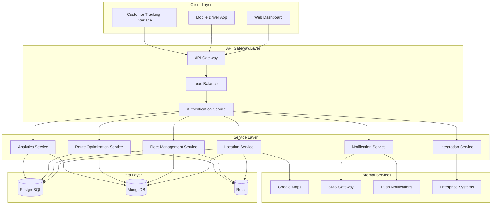

## 4.2 Component Architecture

### 4.2.1 Frontend Components

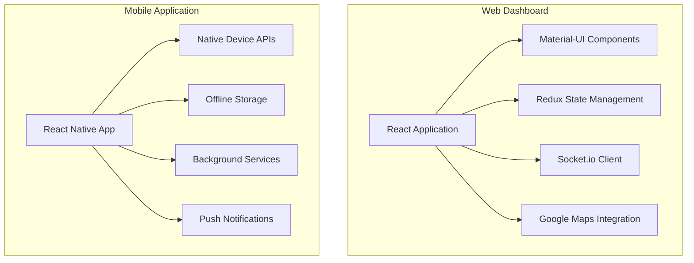

### 4.2.2 Backend Services Architecture

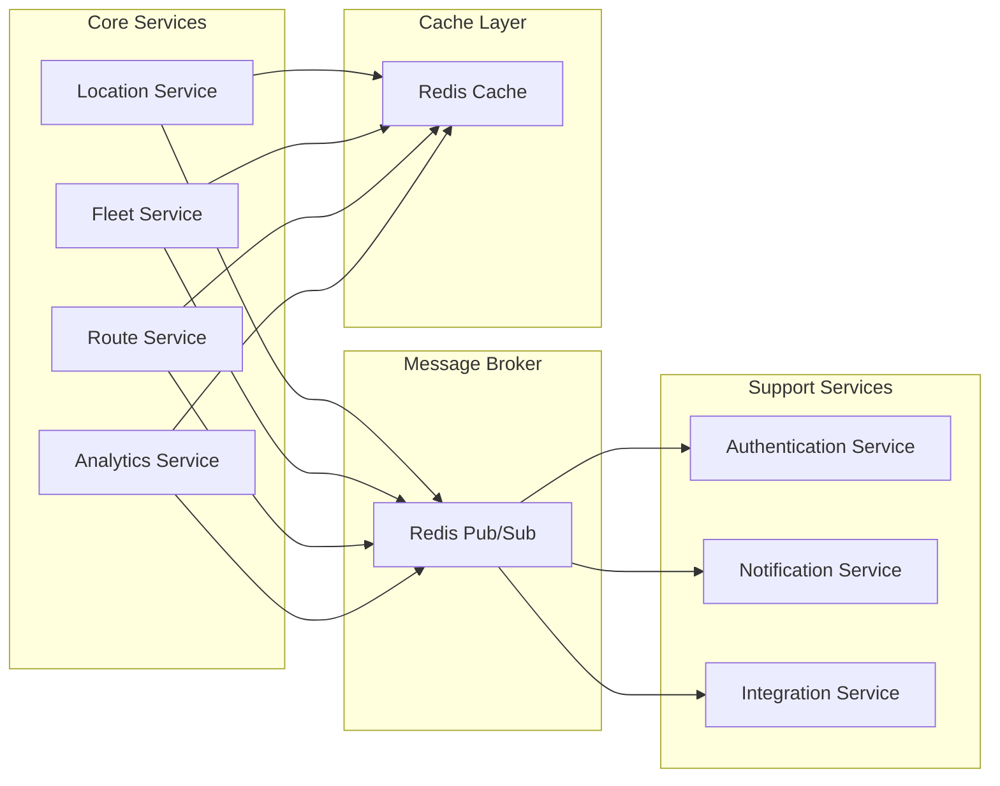

## 4.3 Data Flow Architecture

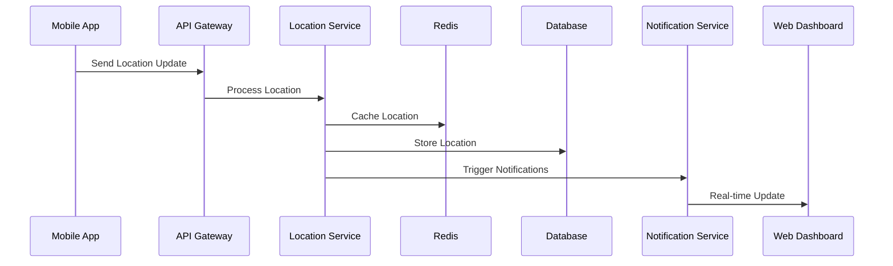

## 4.4 Technology Stack

### 4.4.1 Frontend Technologies
- Web Dashboard: React 18, Material-UI, Redux
- Mobile Apps: React Native, Native Device APIs
- Maps: Google Maps Platform
- Real-time: Socket.io Client

### 4.4.2 Backend Technologies
- API Gateway: Node.js with Express
- Microservices: Node.js and Python
- Authentication: JWT, OAuth 2.0
- Message Broker: Redis Pub/Sub

### 4.4.3 Data Storage
- Primary Database: PostgreSQL 14
- Location Storage: MongoDB
- Caching Layer: Redis
- File Storage: AWS S3

### 4.4.4 Infrastructure
- Cloud Platform: AWS
- Container Orchestration: Kubernetes
- CI/CD: Jenkins
- Monitoring: Prometheus/Grafana

## 4.5 Scalability Architecture

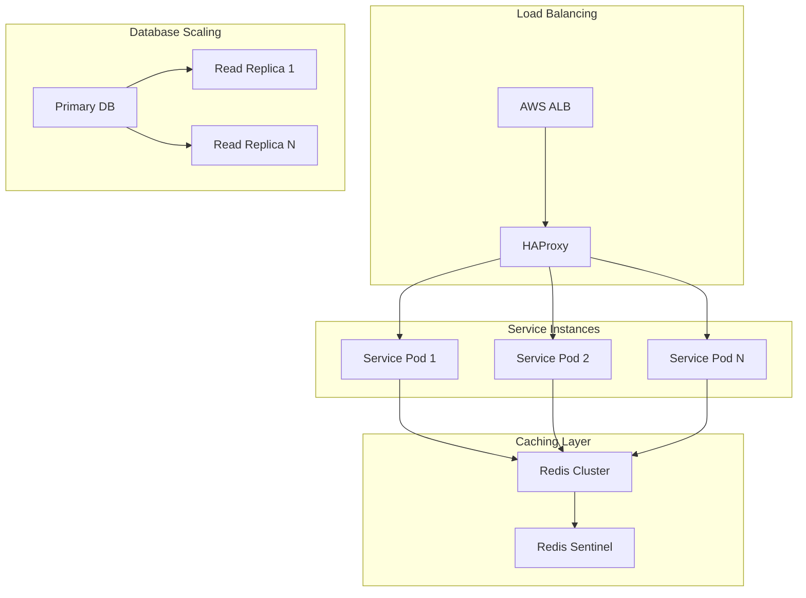

## 4.6 Security Architecture

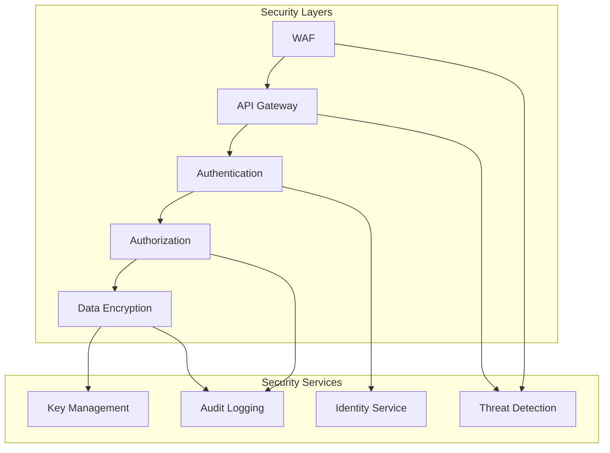

## 4.7 Deployment Architecture

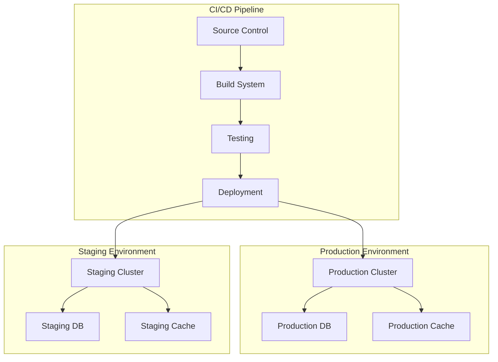

# 5. System Components

## 5.1 Component Diagrams

### 5.1.1 Core System Components

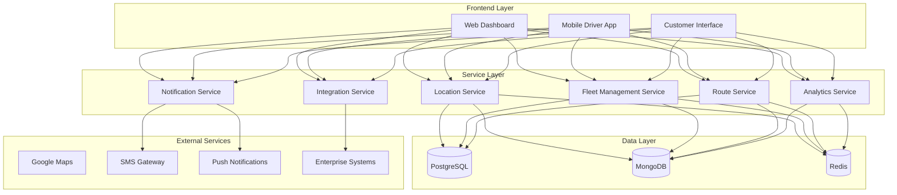

### 5.1.2 Service Component Details

```mermaid
graph TB
    subgraph Location Service
        A1[Location Processor]
        A2[Geofence Manager]
        A3[History Manager]
    end

    subgraph Fleet Service
        B1[Vehicle Manager]
        B2[Driver Manager]
        B3[Asset Tracker]
    end

    subgraph Route Service
        C1[Route Optimizer]
        C2[ETA Calculator]
        C3[Navigation Manager]
    end

    subgraph Analytics Service
        D1[Data Aggregator]
        D2[Report Generator]
        D3[Metrics Calculator]
    end

    A1 --> A2 --> A3
    B1 --> B2 --> B3
    C1 --> C2 --> C3
    D1 --> D2 --> D3
```

## 5.2 Sequence Diagrams

### 5.2.1 Location Update Flow

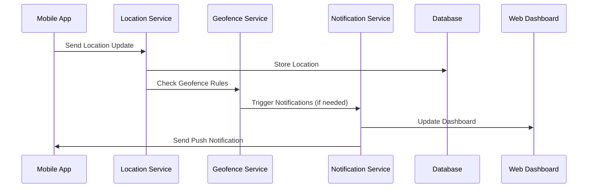

### 5.2.2 Delivery Completion Flow

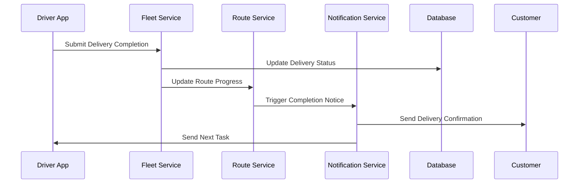

## 5.3 Data Flow Diagrams

### 5.3.1 Real-time Location Data Flow

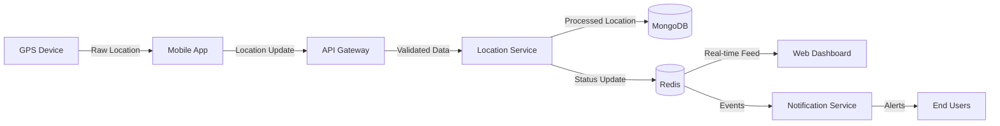

### 5.3.2 Analytics Data Flow

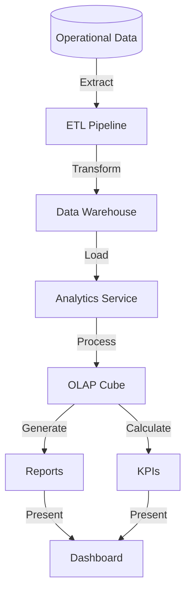

## 5.4 Component Interaction Matrix

| Component | Interacts With | Data Exchange | Protocol |
|-----------|---------------|----------------|-----------|
| Location Service | Mobile App, Fleet Service, Database | GPS coordinates, status updates | WebSocket/REST |
| Fleet Service | Location Service, Route Service, Database | Vehicle data, driver assignments | REST |
| Route Service | Fleet Service, Maps API, Database | Route data, optimization results | REST |
| Analytics Service | Database, Dashboard | Metrics, reports | REST |
| Notification Service | All Services, End Users | Alerts, updates | WebSocket/REST |
| Integration Service | External Systems, Database | Business data, status updates | REST/Webhooks |

## 5.5 Component Dependencies

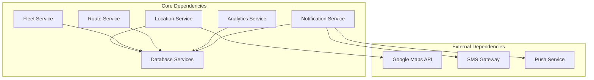

# 7. Technology Stack

## 7.1 Programming Languages

| Layer | Language | Justification |
|-------|----------|---------------|
| Backend Services | Node.js, Python | Node.js for real-time services and event handling, Python for data processing and analytics |
| Web Frontend | TypeScript/JavaScript | Type safety, modern ECMAScript features, wide ecosystem support |
| Mobile Apps | JavaScript (React Native) | Cross-platform development, code reuse, native performance |
| Database Scripts | SQL, JavaScript | Data manipulation, stored procedures, aggregation pipelines |
| DevOps | YAML, Shell Script | Infrastructure configuration, automation scripts |

## 7.2 Frameworks and Libraries

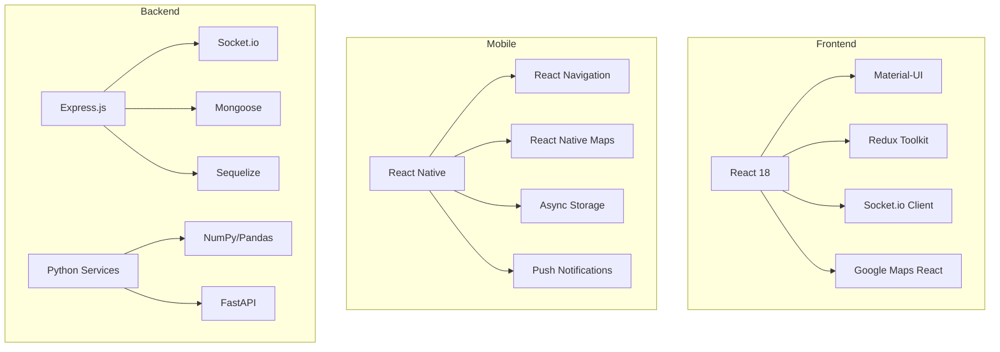

## 7.3 Databases

| Database | Purpose | Key Features |
|----------|---------|--------------|
| PostgreSQL 14 | Primary relational data store | ACID compliance, JSON support, spatial queries |
| MongoDB | Location and event data | Geospatial indexing, horizontal scaling |
| Redis | Caching and real-time data | In-memory storage, pub/sub, geospatial operations |
| Amazon S3 | File storage | Scalable object storage for POD images |

## 7.4 Third-Party Services

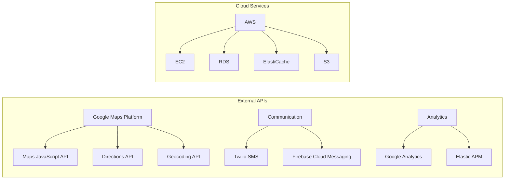

## 7.5 Development and Deployment Tools

| Category | Tools | Purpose |
|----------|-------|---------|
| Containerization | Docker, Kubernetes | Application containerization and orchestration |
| CI/CD | Jenkins, GitHub Actions | Automated testing and deployment |
| Monitoring | Prometheus, Grafana | System metrics and visualization |
| Version Control | Git, GitHub | Source code management |
| API Documentation | Swagger/OpenAPI | API specification and documentation |
| Testing | Jest, PyTest, Postman | Unit testing, integration testing, API testing |

## 7.6 Infrastructure

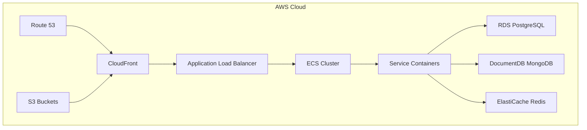

# 6. System Design

## 6.1 User Interface Design

### 6.1.1 Web Dashboard Layout

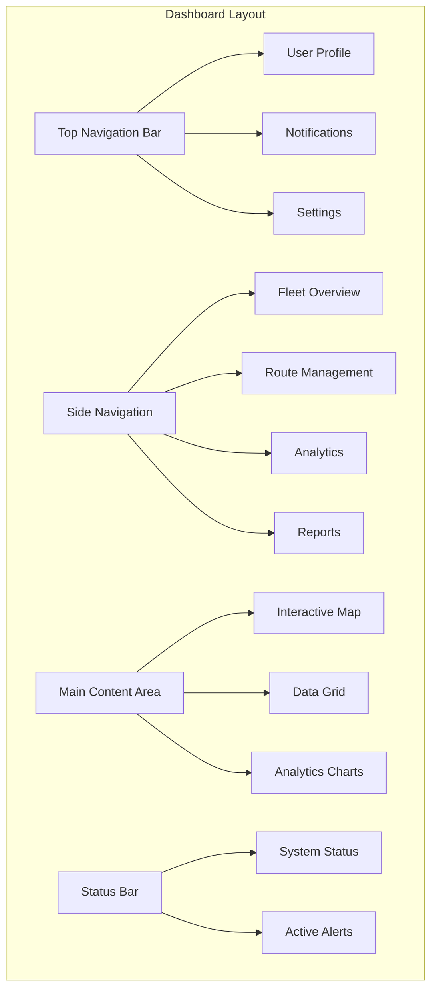

### 6.1.2 Mobile Driver App Layout

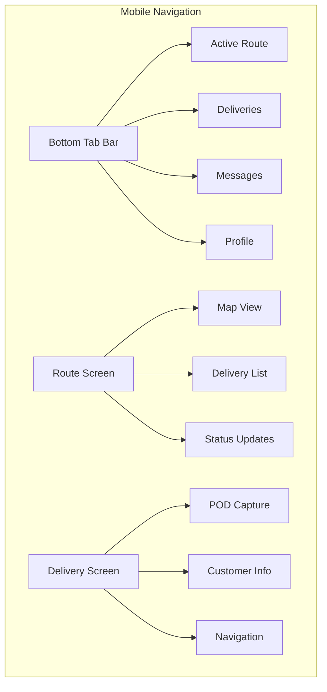

### 6.1.3 Customer Tracking Interface

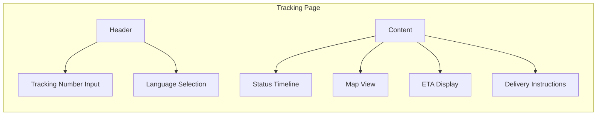

## 6.2 Database Design

### 6.2.1 Relational Schema (PostgreSQL)

| Table Name | Primary Key | Foreign Keys | Indexes |
|------------|-------------|--------------|---------|
| vehicles | vehicle_id | fleet_id | registration_number, status |
| drivers | driver_id | vehicle_id | license_number, status |
| routes | route_id | vehicle_id, driver_id | status, date |
| deliveries | delivery_id | route_id, customer_id | tracking_number, status |
| customers | customer_id | - | email, phone |
| fleet_managers | manager_id | fleet_id | email |
| maintenance_records | record_id | vehicle_id | date |

### 6.2.2 Document Schema (MongoDB)

```javascript
// Location Events Collection
{
  _id: ObjectId,
  vehicle_id: String,
  timestamp: ISODate,
  location: {
    type: "Point",
    coordinates: [longitude, latitude]
  },
  speed: Number,
  heading: Number,
  status: String,
  metadata: Object
}

// Delivery Events Collection
{
  _id: ObjectId,
  delivery_id: String,
  event_type: String,
  timestamp: ISODate,
  location: {
    type: "Point",
    coordinates: [longitude, latitude]
  },
  data: Object
}
```

### 6.2.3 Cache Schema (Redis)

| Key Pattern | Value Type | Purpose | TTL |
|-------------|------------|---------|-----|
| vehicle:location:{id} | Hash | Current vehicle location | 60s |
| route:active:{id} | Hash | Active route details | 1h |
| delivery:status:{id} | String | Current delivery status | 30m |
| user:session:{id} | Hash | User session data | 24h |

## 6.3 API Design

### 6.3.1 RESTful Endpoints

| Endpoint | Method | Purpose | Request/Response Format |
|----------|--------|---------|------------------------|
| /api/v1/vehicles | GET | List all vehicles | JSON Array of Vehicle objects |
| /api/v1/vehicles/{id}/location | GET | Get vehicle location | Location object |
| /api/v1/routes | POST | Create new route | Route object |
| /api/v1/deliveries/{id}/status | PUT | Update delivery status | Status object |
| /api/v1/drivers/{id}/assignments | GET | Get driver assignments | Assignment array |

### 6.3.2 WebSocket Events

```mermaid
sequenceDiagram
    participant Client
    participant Server
    participant Redis
    participant Database

    Client->>Server: connect()
    Server->>Client: authenticated
    Client->>Server: subscribe:vehicle:{id}
    Server->>Redis: channel:subscribe
    Redis-->>Server: location:update
    Server->>Client: vehicle:location:updated
    Client->>Server: delivery:status:update
    Server->>Database: update_status
    Database-->>Server: status_updated
    Server->>Client: delivery:status:updated
```

### 6.3.3 Integration APIs

| Integration | Protocol | Authentication | Rate Limit |
|-------------|----------|----------------|------------|
| Maps API | REST/HTTPS | API Key | 1000/min |
| SMS Gateway | REST/HTTPS | OAuth 2.0 | 100/min |
| ERP System | REST/HTTPS | JWT | 500/min |
| Weather API | REST/HTTPS | API Key | 60/min |
| Analytics | GraphQL | JWT | 100/min |

### 6.3.4 API Response Format

```javascript
{
  "status": "success|error",
  "code": 200,
  "data": {
    // Response payload
  },
  "meta": {
    "timestamp": "ISO8601",
    "version": "1.0",
    "pagination": {
      "page": 1,
      "limit": 25,
      "total": 100
    }
  }
}
```

### 6.3.5 Error Handling

```mermaid
graph TD
    A[API Request] --> B{Validate Request}
    B -->|Invalid| C[Return 400]
    B -->|Valid| D{Process Request}
    D -->|Success| E[Return 200]
    D -->|Not Found| F[Return 404]
    D -->|Server Error| G[Return 500]
    D -->|Unauthorized| H[Return 401]
    D -->|Forbidden| I[Return 403]
```

# 8. Security Considerations

## 8.1 Authentication and Authorization

### 8.1.1 Authentication Methods

| Method | Use Case | Implementation |
|--------|----------|----------------|
| OAuth 2.0 + OIDC | Web/Mobile App Login | Auth0 Integration |
| JWT | API Authentication | Node.js jsonwebtoken |
| TOTP | Two-Factor Authentication | Speakeasy library |
| API Keys | External System Integration | Custom key management |
| Session Tokens | Web Dashboard | Redis session store |

### 8.1.2 Authorization Model

```mermaid
graph TD
    A[User Request] --> B{Authentication}
    B -->|Valid| C{Role Check}
    B -->|Invalid| D[401 Unauthorized]
    C -->|Authorized| E[Access Granted]
    C -->|Unauthorized| F[403 Forbidden]
    
    subgraph Roles
        G[System Admin]
        H[Fleet Manager]
        I[Dispatcher]
        J[Driver]
        K[Customer]
    end
    
    subgraph Permissions
        L[Full Access]
        M[Fleet Management]
        N[Route Management]
        O[Delivery Management]
        P[Tracking Access]
    end
```

## 8.2 Data Security

### 8.2.1 Encryption Standards

| Data Type | At Rest | In Transit |
|-----------|---------|------------|
| User Credentials | AES-256 | TLS 1.3 |
| Location Data | AES-256 | TLS 1.3 |
| Personal Information | AES-256 + Field Level | TLS 1.3 |
| API Communications | N/A | TLS 1.3 + Certificate Pinning |
| Database Backups | AES-256 | TLS 1.3 |

### 8.2.2 Data Protection Measures

```mermaid
graph LR
    A[Input Data] --> B{Validation Layer}
    B --> C[Sanitization]
    C --> D[Encryption]
    D --> E{Storage Type}
    E --> F[(Encrypted Database)]
    E --> G[(Secure File Storage)]
    
    H[Access Request] --> I{Authentication}
    I --> J{Authorization}
    J --> K[Decryption]
    K --> L[Data Access]
```

## 8.3 Security Protocols

### 8.3.1 Network Security

| Layer | Protection Measure | Implementation |
|-------|-------------------|----------------|
| Edge | AWS WAF | IP filtering, rate limiting |
| Transport | TLS 1.3 | Let's Encrypt certificates |
| API | API Gateway | Request validation, throttling |
| Internal | VPC | Network isolation, security groups |
| Database | Private Subnet | No public access |

### 8.3.2 Security Monitoring

```mermaid
graph TB
    A[Security Events] --> B{SIEM System}
    B --> C[Log Analysis]
    B --> D[Threat Detection]
    B --> E[Compliance Monitoring]
    
    C --> F[Alert Generation]
    D --> F
    E --> F
    
    F --> G[Security Team]
    F --> H[Automated Response]
```

### 8.3.3 Security Compliance Controls

| Requirement | Implementation | Monitoring |
|-------------|----------------|------------|
| GDPR | Data encryption, consent management | Audit logs |
| CCPA | Data privacy controls, access rights | Compliance reports |
| SOC 2 | Security controls, access monitoring | Continuous assessment |
| ISO 27001 | Security management framework | Regular audits |

### 8.3.4 Incident Response

```mermaid
graph LR
    A[Security Event] --> B{Severity Assessment}
    B -->|High| C[Immediate Response]
    B -->|Medium| D[Scheduled Response]
    B -->|Low| E[Routine Handling]
    
    C --> F[Containment]
    D --> F
    E --> F
    
    F --> G[Investigation]
    G --> H[Resolution]
    H --> I[Post-Mortem]
```

### 8.3.5 Security Update Management

| Component | Update Frequency | Process |
|-----------|-----------------|---------|
| System Packages | Weekly | Automated patching |
| Dependencies | Monthly | Dependency scanning |
| Security Patches | As available | Emergency deployment |
| SSL Certificates | 90 days | Automated renewal |
| Security Policies | Quarterly | Manual review |

# 9. Infrastructure

## 9.1 Deployment Environment

The Live Fleet Tracking System utilizes a cloud-native deployment model with geographically distributed resources to ensure high availability and optimal performance.

```mermaid
graph TB
    subgraph Production Environment
        A[Primary Region - US East]
        B[Secondary Region - US West]
        C[DR Region - EU Central]
    end
    
    subgraph Environment Types
        D[Development]
        E[Staging]
        F[Production]
        G[DR]
    end
    
    A --> B
    B --> C
    D --> E --> F --> G
```

| Environment | Purpose | Configuration |
|-------------|---------|---------------|
| Development | Feature development and testing | Single region, reduced resources |
| Staging | Pre-production testing and validation | Multi-region, production-like |
| Production | Live system operation | Full multi-region deployment |
| DR | Disaster recovery failover | Hot standby configuration |

## 9.2 Cloud Services

The system leverages AWS cloud services for its infrastructure needs:

| Service | Purpose | Configuration |
|---------|---------|---------------|
| EKS | Kubernetes container orchestration | Multi-AZ deployment |
| RDS | PostgreSQL database hosting | Multi-AZ with read replicas |
| DocumentDB | MongoDB-compatible database | Cluster with 3 nodes |
| ElastiCache | Redis caching layer | Cluster mode enabled |
| CloudFront | Global CDN | Edge locations worldwide |
| Route 53 | DNS management | Active-active routing |
| S3 | Object storage | Cross-region replication |
| CloudWatch | Monitoring and logging | Custom metrics and dashboards |

```mermaid
graph TB
    subgraph AWS Infrastructure
        A[Route 53] --> B[CloudFront]
        B --> C[ALB]
        C --> D[EKS Cluster]
        D --> E[EC2 Node Groups]
        D --> F[RDS]
        D --> G[DocumentDB]
        D --> H[ElastiCache]
        I[S3] --> B
        J[CloudWatch] --> D
    end
```

## 9.3 Containerization

Docker containers are used for all application components:

| Component | Base Image | Resource Limits |
|-----------|------------|-----------------|
| API Services | node:18-alpine | 2 CPU, 4GB RAM |
| Web Dashboard | nginx:alpine | 1 CPU, 2GB RAM |
| Analytics Services | python:3.11-slim | 2 CPU, 8GB RAM |
| Background Workers | node:18-alpine | 2 CPU, 4GB RAM |

```mermaid
graph LR
    subgraph Container Architecture
        A[Base Images] --> B[Build Layer]
        B --> C[Application Layer]
        C --> D[Configuration Layer]
        
        E[Docker Registry] --> F[Container Orchestration]
        F --> G[Pod Deployment]
    end
```

## 9.4 Orchestration

Kubernetes is used for container orchestration with the following configuration:

| Resource Type | Purpose | Configuration |
|--------------|---------|---------------|
| Deployments | Application workloads | Rolling updates, auto-scaling |
| StatefulSets | Stateful services | Persistent storage, ordered deployment |
| DaemonSets | System services | Monitoring, logging agents |
| Services | Internal networking | ClusterIP, LoadBalancer types |
| Ingress | External access | SSL termination, routing rules |

```mermaid
graph TB
    subgraph Kubernetes Architecture
        A[Ingress Controller] --> B[Services]
        B --> C[Deployments]
        B --> D[StatefulSets]
        B --> E[DaemonSets]
        
        C --> F[Pods]
        D --> G[Persistent Pods]
        E --> H[System Pods]
        
        I[HPA] --> C
        J[PDB] --> C
    end
```

## 9.5 CI/CD Pipeline

The continuous integration and deployment pipeline is implemented using GitHub Actions and ArgoCD:

```mermaid
graph LR
    subgraph CI Pipeline
        A[Git Push] --> B[GitHub Actions]
        B --> C[Build]
        C --> D[Test]
        D --> E[Security Scan]
        E --> F[Package]
        F --> G[Push to Registry]
    end
    
    subgraph CD Pipeline
        H[ArgoCD] --> I[Config Repo]
        I --> J[Sync]
        J --> K[Deploy]
        K --> L[Validate]
        L --> M[Monitor]
    end
    
    G --> H
```

| Stage | Tools | Purpose |
|-------|-------|---------|
| Source Control | GitHub | Code repository and version control |
| CI | GitHub Actions | Automated building and testing |
| Security | Snyk, SonarQube | Code and container security scanning |
| Registry | Amazon ECR | Container image storage |
| CD | ArgoCD | GitOps-based deployment |
| Monitoring | Prometheus, Grafana | Deployment monitoring and alerts |

### Deployment Process

1. Code changes are pushed to GitHub
2. GitHub Actions triggers automated tests and builds
3. Container images are built and scanned for vulnerabilities
4. Approved images are pushed to Amazon ECR
5. ArgoCD detects changes in the configuration repository
6. Changes are automatically synchronized to the cluster
7. Health checks validate the deployment
8. Monitoring alerts on deployment status

# APPENDICES

## A.1 Additional Technical Information

### A.1.1 System Health Monitoring Thresholds

| Metric | Warning Threshold | Critical Threshold | Action |
|--------|------------------|-------------------|---------|
| CPU Usage | 70% | 90% | Auto-scaling trigger |
| Memory Usage | 75% | 95% | Service restart |
| API Response Time | 500ms | 2000ms | Alert generation |
| Database Connections | 80% pool | 95% pool | Connection recycling |
| Queue Length | 1000 messages | 5000 messages | Worker scaling |
| Disk Usage | 75% | 90% | Storage expansion |

### A.1.2 Error Handling States

```mermaid
stateDiagram-v2
    [*] --> Normal
    Normal --> Warning: Threshold Exceeded
    Warning --> Critical: Escalation
    Critical --> Recovery: Intervention
    Recovery --> Normal: Resolution
    Critical --> Emergency: System Failure
    Emergency --> Recovery: Crisis Management
    Recovery --> [*]
```

### A.1.3 Backup Strategy Matrix

| Data Type | Frequency | Retention | Storage Location |
|-----------|-----------|-----------|------------------|
| Configuration | Hourly | 30 days | S3 + Glacier |
| Transaction Data | Real-time | 7 years | Multi-region RDS |
| Location History | Daily | 1 year | MongoDB Atlas |
| System Logs | Weekly | 90 days | CloudWatch |
| Analytics Data | Monthly | 5 years | Redshift |

## A.2 Glossary

| Term | Definition |
|------|------------|
| Active-Active Redundancy | System deployment where multiple identical systems run simultaneously |
| Circuit Breaker | Design pattern that prevents cascading failures in distributed systems |
| Dead Letter Queue | Storage for messages that cannot be processed successfully |
| Event Sourcing | Pattern of storing state changes as a sequence of events |
| Horizontal Sharding | Database partitioning across multiple servers based on data characteristics |
| Idempotency | Property where operations can be repeated without changing the result |
| Load Shedding | Selective dropping of work under extreme load conditions |
| Polyglot Persistence | Using different database types for different data storage needs |
| Service Mesh | Infrastructure layer for handling service-to-service communication |
| Throttling | Controlling the rate of resource usage or request processing |

## A.3 Acronyms

| Acronym | Full Form |
|---------|-----------|
| APM | Application Performance Monitoring |
| CQRS | Command Query Responsibility Segregation |
| DLQ | Dead Letter Queue |
| ECS | Elastic Container Service |
| IOPS | Input/Output Operations Per Second |
| JWT | JSON Web Token |
| MTBF | Mean Time Between Failures |
| MTTR | Mean Time To Recovery |
| OLTP | Online Transaction Processing |
| POD | Proof of Delivery |
| RTO | Recovery Time Objective |
| RPO | Recovery Point Objective |
| SLA | Service Level Agreement |
| VPC | Virtual Private Cloud |
| WAF | Web Application Firewall |
| XSS | Cross-Site Scripting |

### A.3.1 Service-Specific Acronyms

```mermaid
graph TD
    A[System Acronyms] --> B[Infrastructure]
    A --> C[Security]
    A --> D[Operations]
    
    B --> E[AWS - Amazon Web Services]
    B --> F[K8s - Kubernetes]
    B --> G[LB - Load Balancer]
    
    C --> H[MFA - Multi-Factor Authentication]
    C --> I[SSO - Single Sign-On]
    C --> J[IAM - Identity Access Management]
    
    D --> K[SRE - Site Reliability Engineering]
    D --> L[DevOps - Development Operations]
    D --> M[CI/CD - Continuous Integration/Deployment]
```