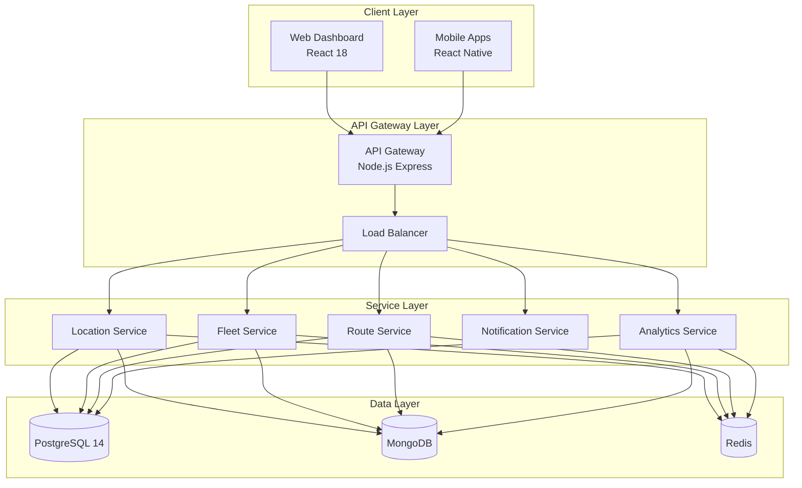
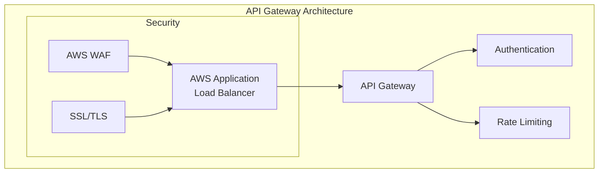
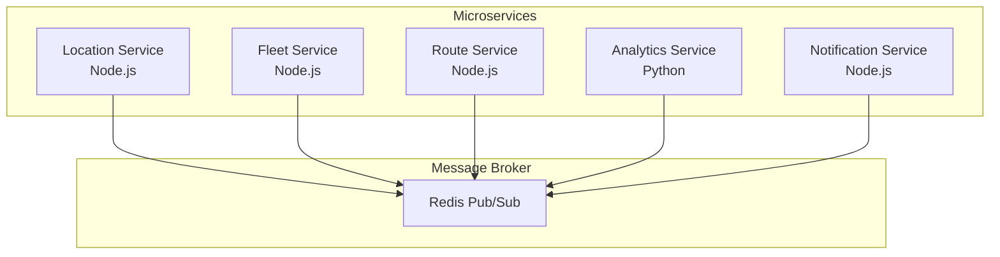
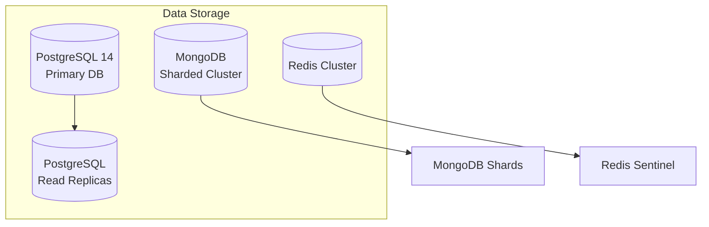
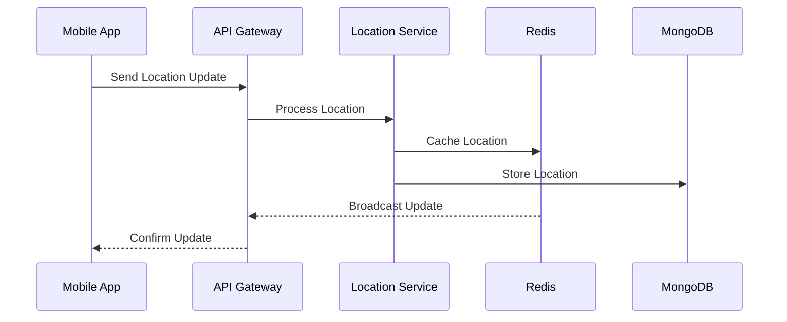
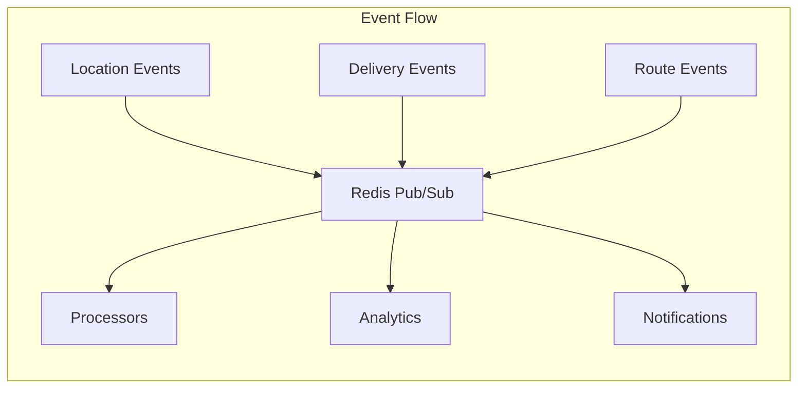
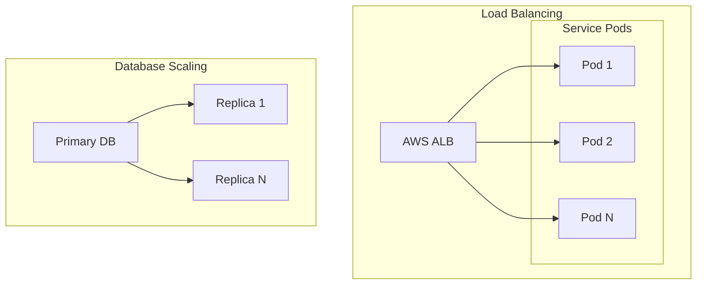
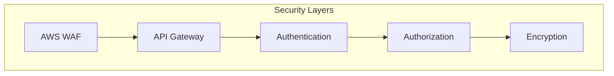
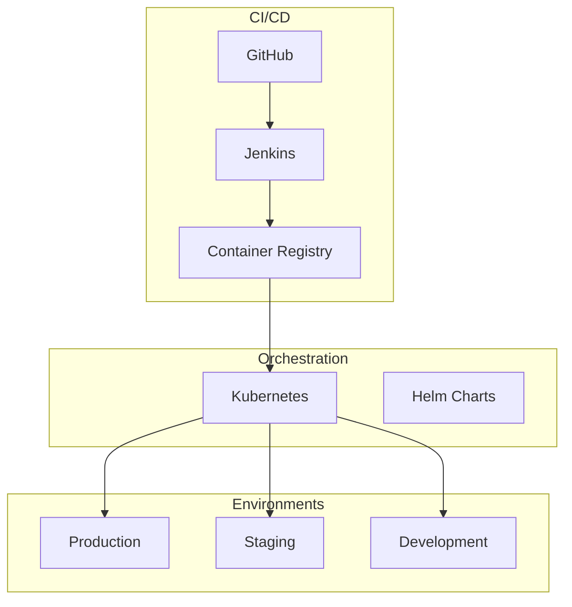

<!-- Human Tasks:
1. Review and validate the architecture diagrams for accuracy
2. Ensure all listed technology versions are current and approved
3. Verify security compliance requirements are up-to-date
4. Confirm infrastructure costs align with budget
5. Review and approve deployment strategies
-->

# Live Fleet Tracking System Architecture Documentation

<!-- Using mermaid-js v9.x for architecture diagrams -->

## 1. System Overview

The Live Fleet Tracking System is a cloud-based microservices architecture designed for real-time fleet tracking and management with the following core capabilities:

- Real-time GPS tracking with 30-second update intervals
- Support for 10,000+ concurrent users with sub-second response times
- 99.9% system uptime requirement
- Cloud-native microservices architecture
- Multi-platform support (Web, iOS, Android)

## 2. Architecture Components

### 2.1 Client Layer

#### Web Dashboard
- React 18 with Material-UI
- Real-time WebSocket connections
- Google Maps Platform integration
- Redux state management

#### Mobile Applications
- React Native for iOS and Android
- Offline-first architecture
- Background location tracking
- Digital proof of delivery

### 2.2 API Gateway Layer

### 2.3 Service Layer

### 2.4 Data Layer

## 3. Data Flow Patterns

### 3.1 Real-time Location Updates

### 3.2 Event Processing

## 4. Technology Stack

### 4.1 Frontend Technologies
- React 18 with Material-UI
- React Native for mobile apps
- Google Maps Platform
- Socket.io for real-time updates

### 4.2 Backend Technologies
- Node.js for microservices
- Python for analytics
- Express.js framework
- Socket.io for WebSocket support

### 4.3 Databases
- PostgreSQL 14 for relational data
- MongoDB for location data
- Redis for caching and pub/sub

### 4.4 Infrastructure
- AWS cloud platform
- Kubernetes orchestration
- Jenkins CI/CD pipeline
- Prometheus/Grafana monitoring

## 5. Scalability Architecture

## 6. Security Architecture

### 6.1 Security Measures
- JWT and OAuth 2.0 authentication
- Role-based access control
- Data encryption at rest and in transit
- AWS WAF protection
- Security audit logging

## 7. Deployment Architecture

### 7.1 Environment Configuration
- Production: Multi-AZ deployment
- Staging: Production-like environment
- Development: Single-zone setup

### 7.2 Deployment Process
- Automated CI/CD with Jenkins
- Kubernetes orchestration
- Blue-green deployments
- Automated rollback capability

## 8. Integration Patterns

### 8.1 API Integration
- RESTful API endpoints
- WebSocket connections
- Enterprise system connectors
- Webhook notifications

### 8.2 Data Integration
- ETL pipelines
- Real-time streaming
- Batch processing
- Data synchronization

Last Updated: 2024-01-19
Version: 1.0
Contributors: System Architects, Technical Leads
Review Status: Required