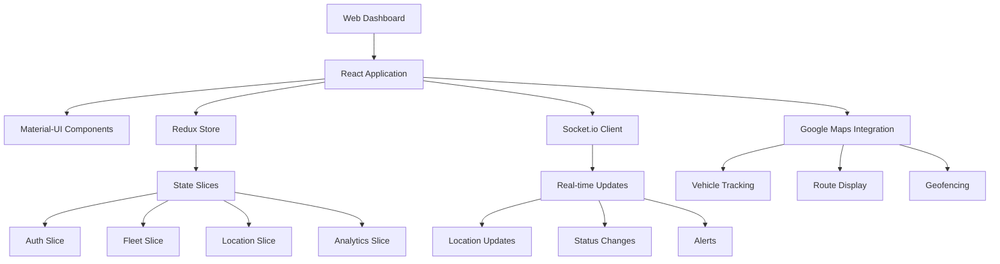
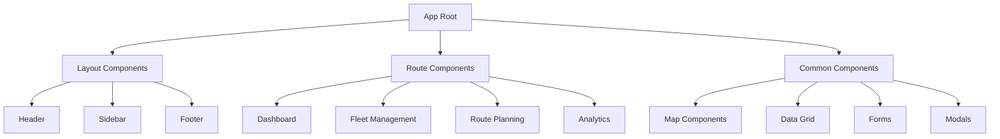
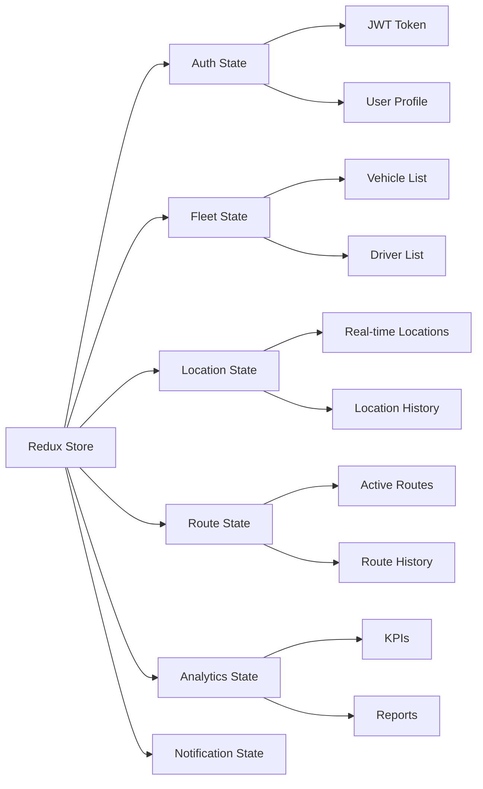
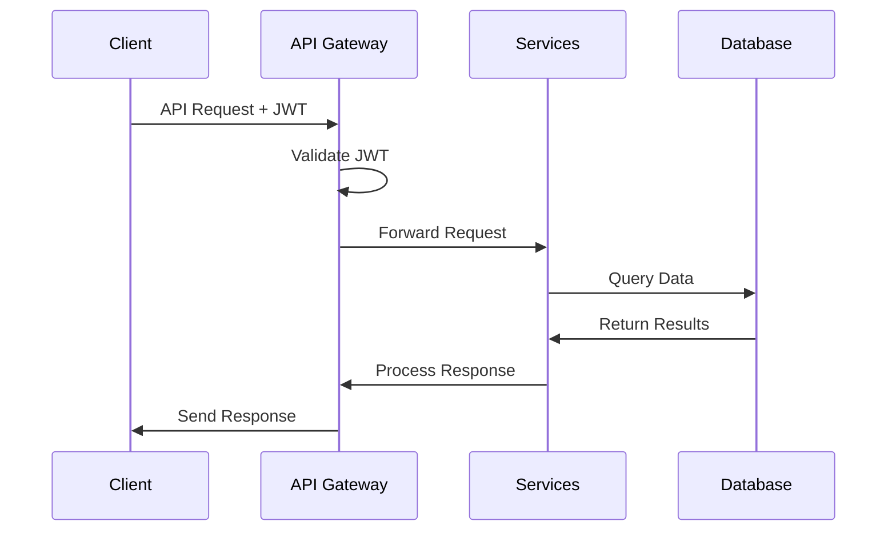
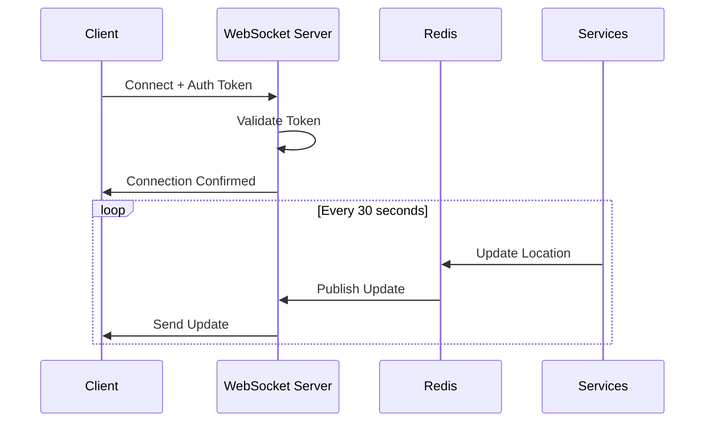
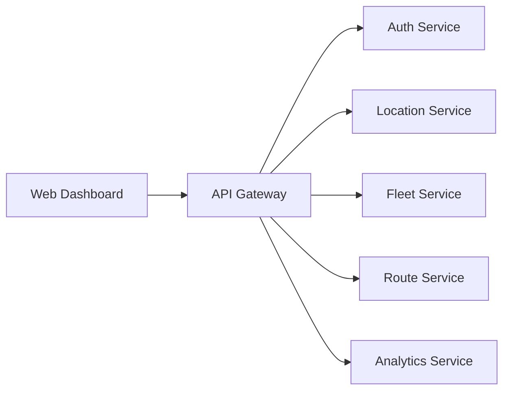
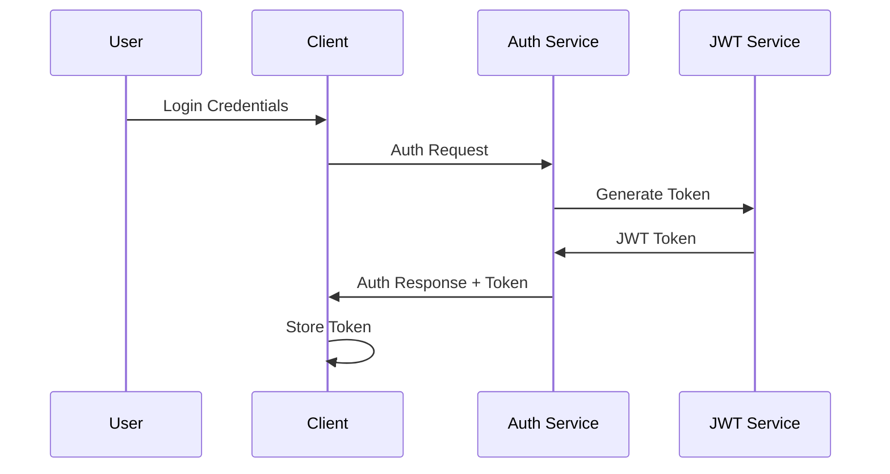

# Live Fleet Tracking System Web Dashboard Architecture

<!-- HUMAN TASKS -->
<!-- 
1. Configure Google Maps API key and usage quotas
2. Set up Socket.io server endpoints and security
3. Configure Redis cache TTL settings
4. Review and adjust real-time update intervals
5. Set up monitoring for WebSocket connections
6. Configure JWT secret and token expiration
7. Set up CORS policies for API endpoints
8. Review Material-UI theme customization
9. Configure analytics event tracking
10. Set up error tracking and logging
-->

# 1. System Overview

## 1.1 Technology Stack
- **Frontend Framework**: React 18 with TypeScript
- **UI Components**: Material-UI v5
- **State Management**: Redux Toolkit with slice pattern
- **Real-time Updates**: Socket.io client with 30-second intervals
- **Maps Integration**: Google Maps Platform
- **Build Tools**: Webpack 5, Babel
- **Testing**: Jest, React Testing Library
- **Type Checking**: TypeScript 4.9+

## 1.2 Key Components


## 1.3 Design Principles
- Component-based architecture with SOLID principles
- Responsive design with mobile-first approach
- Real-time data synchronization
- Offline-first capabilities
- Modular and maintainable code structure
- Comprehensive error handling
- Performance optimization
- Accessibility compliance (WCAG 2.1 AA)

# 2. Frontend Architecture

## 2.1 Component Structure


## 2.2 State Management


## 2.3 Routing System
```typescript
// Protected route configuration
interface RouteConfig {
  path: string;
  component: React.ComponentType;
  roles: string[];
  exact?: boolean;
}

const routes: RouteConfig[] = [
  {
    path: '/dashboard',
    component: Dashboard,
    roles: ['admin', 'manager', 'dispatcher']
  },
  {
    path: '/fleet',
    component: FleetManagement,
    roles: ['admin', 'manager']
  },
  {
    path: '/routes',
    component: RouteManagement,
    roles: ['admin', 'dispatcher']
  }
];
```

## 2.4 Real-time Updates
```typescript
// Socket.io configuration with 30-second intervals
interface SocketConfig {
  url: string;
  options: {
    reconnection: boolean;
    reconnectionDelay: number;
    reconnectionAttempts: number;
  };
  updateInterval: number;
}

const socketConfig: SocketConfig = {
  url: process.env.REACT_APP_SOCKET_URL,
  options: {
    reconnection: true,
    reconnectionDelay: 1000,
    reconnectionAttempts: 10
  },
  updateInterval: 30000 // 30 seconds
};
```

# 3. Data Flow

## 3.1 API Integration


## 3.2 WebSocket Communication


## 3.3 State Updates
```typescript
// Redux action flow
interface LocationUpdate {
  vehicleId: string;
  latitude: number;
  longitude: number;
  timestamp: string;
  speed: number;
  heading: number;
}

// Location slice
const locationSlice = createSlice({
  name: 'location',
  initialState,
  reducers: {
    updateLocation(state, action: PayloadAction<LocationUpdate>) {
      const { vehicleId, ...location } = action.payload;
      state.locations[vehicleId] = location;
    }
  }
});
```

## 3.4 Caching Strategy
```typescript
// Redis caching configuration
interface CacheConfig {
  keyPrefix: string;
  ttl: number; // seconds
  maxSize: number;
}

const cacheConfig: CacheConfig = {
  keyPrefix: 'web_dashboard:',
  ttl: 60, // 1 minute
  maxSize: 10000
};
```

# 4. Integration Architecture

## 4.1 Backend Services


## 4.2 Google Maps Platform
```typescript
// Maps configuration
interface MapsConfig {
  apiKey: string;
  libraries: string[];
  options: {
    center: { lat: number; lng: number };
    zoom: number;
    styles: any[];
  };
}

const mapsConfig: MapsConfig = {
  apiKey: process.env.REACT_APP_MAPS_API_KEY,
  libraries: ['places', 'geometry', 'drawing'],
  options: {
    center: { lat: 40.7128, lng: -74.0060 },
    zoom: 12,
    styles: [] // Custom map styles
  }
};
```

## 4.3 Real-time Services
```typescript
// Socket.io event handlers
interface SocketEvents {
  'location:update': (data: LocationUpdate) => void;
  'route:update': (data: RouteUpdate) => void;
  'alert:new': (data: AlertData) => void;
  'connection:error': (error: Error) => void;
}

const socketEvents: SocketEvents = {
  'location:update': (data) => store.dispatch(updateLocation(data)),
  'route:update': (data) => store.dispatch(updateRoute(data)),
  'alert:new': (data) => store.dispatch(addAlert(data)),
  'connection:error': (error) => console.error('Socket error:', error)
};
```

## 4.4 Analytics Integration
```typescript
// Analytics event tracking
interface AnalyticsEvent {
  category: string;
  action: string;
  label?: string;
  value?: number;
}

const trackEvent = (event: AnalyticsEvent): void => {
  analytics.track(event.category, {
    action: event.action,
    label: event.label,
    value: event.value
  });
};
```

# 5. Security Architecture

## 5.1 Authentication Flow


## 5.2 Authorization System
```typescript
// Role-based access control
interface RBACConfig {
  roles: string[];
  permissions: {
    [key: string]: string[];
  };
}

const rbacConfig: RBACConfig = {
  roles: ['admin', 'manager', 'dispatcher', 'viewer'],
  permissions: {
    admin: ['read', 'write', 'delete'],
    manager: ['read', 'write'],
    dispatcher: ['read', 'write'],
    viewer: ['read']
  }
};
```

## 5.3 Data Protection
```typescript
// Security configuration
interface SecurityConfig {
  jwt: {
    expiresIn: string;
    refreshThreshold: number;
  };
  encryption: {
    algorithm: string;
    keySize: number;
  };
  cors: {
    origins: string[];
    methods: string[];
  };
}

const securityConfig: SecurityConfig = {
  jwt: {
    expiresIn: '1h',
    refreshThreshold: 300 // 5 minutes
  },
  encryption: {
    algorithm: 'AES-256-GCM',
    keySize: 256
  },
  cors: {
    origins: [process.env.REACT_APP_API_URL],
    methods: ['GET', 'POST', 'PUT', 'DELETE']
  }
};
```

## 5.4 API Security
```typescript
// Rate limiting configuration
interface RateLimitConfig {
  windowMs: number;
  maxRequests: number;
  message: string;
}

const rateLimitConfig: RateLimitConfig = {
  windowMs: 15 * 60 * 1000, // 15 minutes
  maxRequests: 100,
  message: 'Too many requests, please try again later'
};
```

# 6. Best Practices

## 6.1 Code Architecture
- Clean Code Architecture with SOLID principles
- DRY (Don't Repeat Yourself) with reusable components
- Single Responsibility Principle for components
- Dependency Injection pattern
- Error Boundary implementation
- Proper TypeScript typing

## 6.2 Performance
- React.memo for component memoization
- useMemo and useCallback hooks
- Code splitting and lazy loading
- Image optimization
- Bundle size optimization
- Service Worker implementation

## 6.3 Testing
- Unit tests for components
- Integration tests for features
- End-to-end testing
- Performance testing
- Accessibility testing
- Security testing

## 6.4 Monitoring
- Error tracking
- Performance monitoring
- User behavior analytics
- Real-time metrics
- System health checks
- Security auditing