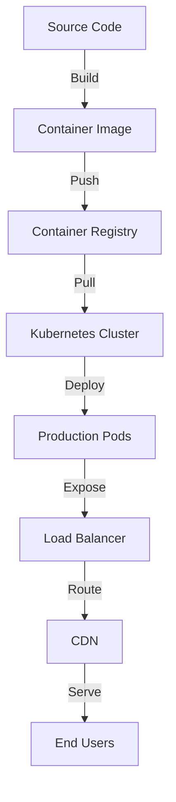
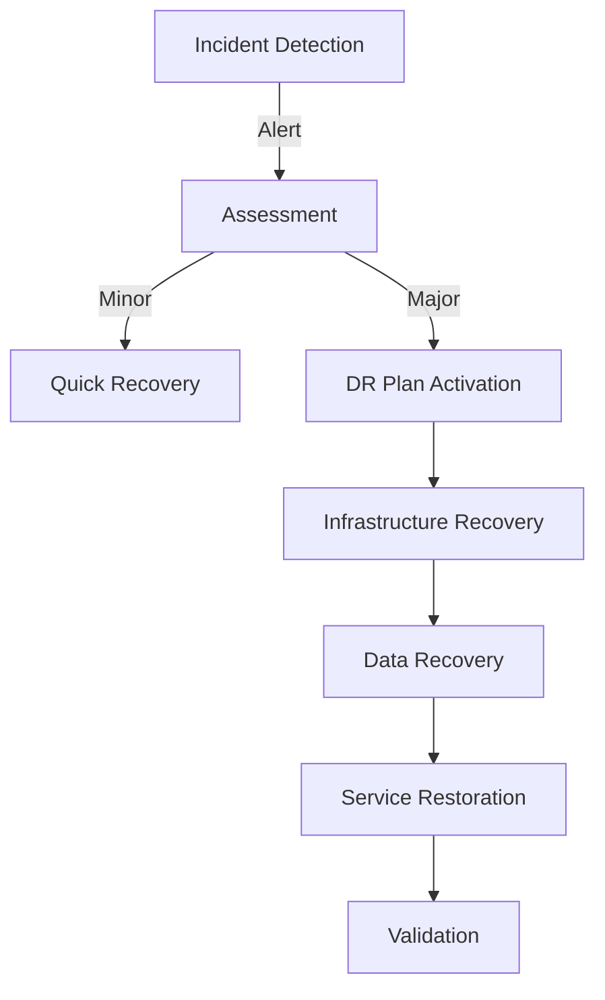

# Live Fleet Tracking System Web Dashboard Deployment Guide

<!-- HUMAN TASKS -->
<!-- 
1. Configure AWS credentials for container registry access
2. Set up SSL certificates for domain(s)
3. Configure DNS records in Route 53
4. Set up monitoring access in Grafana
5. Configure backup retention policies
6. Review and adjust resource quotas
7. Set up alert notification channels
8. Configure external service API keys
-->

## 1. Deployment Overview

### 1.1 Deployment Environments

| Environment | Purpose | Configuration |
|-------------|---------|---------------|
| Development | Feature testing | Single replica, minimal resources |
| Staging | Pre-production validation | 2 replicas, production-like setup |
| Production | Live system | 3+ replicas, full HA configuration |

### 1.2 Infrastructure Requirements

- Kubernetes cluster (EKS) version 1.24+
- Node pools with minimum 4 vCPUs and 8GB RAM
- AWS Application Load Balancer
- Route 53 for DNS management
- AWS Certificate Manager for SSL/TLS
- Amazon ECR for container registry

### 1.3 Deployment Strategy



## 2. Production Environment Setup

### 2.1 Kubernetes Cluster Configuration

```yaml
# Cluster Specifications
Region: us-east-1
Version: 1.24
Node Groups:
  - Name: web-dashboard
    Instance Type: t3.large
    Min Size: 3
    Max Size: 10
    Desired Size: 3
```

### 2.2 Container Registry Setup

```bash
# Configure AWS ECR
aws ecr create-repository \
    --repository-name fleet-tracking/web-dashboard \
    --image-scanning-configuration scanOnPush=true \
    --encryption-configuration encryptionType=AES256
```

### 2.3 SSL/TLS Configuration

```yaml
# Certificate Configuration
Domain: dashboard.fleettracking.com
Provider: AWS Certificate Manager
Type: TLS 1.3
Sans:
  - www.dashboard.fleettracking.com
  - api.dashboard.fleettracking.com
```

### 2.4 Environment Variables

```bash
# Required Environment Variables
REACT_APP_API_URL=https://api.fleettracking.com
REACT_APP_SOCKET_URL=wss://ws.fleettracking.com
REACT_APP_MAPS_API_KEY=${GOOGLE_MAPS_API_KEY}
REACT_APP_ENVIRONMENT=production
```

## 3. Deployment Process

### 3.1 Build Process

```bash
# Build Container Image
docker build -t fleet-tracking/web-dashboard:${VERSION} \
    --build-arg NODE_ENV=production \
    --build-arg API_URL=${API_URL} \
    .

# Tag and Push Image
docker tag fleet-tracking/web-dashboard:${VERSION} \
    ${ECR_REGISTRY}/fleet-tracking/web-dashboard:${VERSION}
docker push ${ECR_REGISTRY}/fleet-tracking/web-dashboard:${VERSION}
```

### 3.2 Container Image Creation

```dockerfile
# Production Optimized Image
FROM node:18-alpine AS builder
WORKDIR /app
COPY package*.json ./
RUN npm ci
COPY . .
RUN npm run build

FROM nginx:alpine
COPY --from=builder /app/build /usr/share/nginx/html
COPY nginx/nginx.conf /etc/nginx/conf.d/default.conf
```

### 3.3 Kubernetes Deployment

```yaml
# Key Deployment Configurations
apiVersion: apps/v1
kind: Deployment
metadata:
  name: web-dashboard
spec:
  replicas: 3
  strategy:
    type: RollingUpdate
    rollingUpdate:
      maxSurge: 1
      maxUnavailable: 0
  template:
    spec:
      containers:
        - name: web-dashboard
          resources:
            requests:
              cpu: "200m"
              memory: "256Mi"
            limits:
              cpu: "500m"
              memory: "512Mi"
```

### 3.4 Health Checks

```yaml
# Health Check Configuration
livenessProbe:
  httpGet:
    path: /health
    port: 80
  initialDelaySeconds: 30
  periodSeconds: 15
readinessProbe:
  httpGet:
    path: /health
    port: 80
  initialDelaySeconds: 10
  periodSeconds: 10
```

## 4. Scaling Configuration

### 4.1 Auto-scaling Rules

```yaml
# HPA Configuration
apiVersion: autoscaling/v2
kind: HorizontalPodAutoscaler
metadata:
  name: web-dashboard-hpa
spec:
  minReplicas: 3
  maxReplicas: 10
  metrics:
    - type: Resource
      resource:
        name: cpu
        target:
          type: Utilization
          averageUtilization: 70
```

### 4.2 Resource Limits

```yaml
# Resource Quotas
apiVersion: v1
kind: ResourceQuota
metadata:
  name: web-dashboard-quota
spec:
  hard:
    requests.cpu: "4"
    requests.memory: 8Gi
    limits.cpu: "8"
    limits.memory: 16Gi
```

### 4.3 Load Balancing

```yaml
# Load Balancer Configuration
apiVersion: v1
kind: Service
metadata:
  name: web-dashboard-service
spec:
  type: LoadBalancer
  ports:
    - port: 80
      targetPort: 80
  selector:
    app: web-dashboard
```

### 4.4 Performance Monitoring

```yaml
# Prometheus Monitoring
annotations:
  prometheus.io/scrape: "true"
  prometheus.io/port: "9113"
  prometheus.io/path: "/metrics"
```

## 5. Monitoring and Maintenance

### 5.1 Health Monitoring

```yaml
# Monitoring Stack
Components:
  - Prometheus
  - Grafana
  - AlertManager
  - Node Exporter
Metrics:
  - Response Time
  - Error Rate
  - CPU Usage
  - Memory Usage
  - Request Count
```

### 5.2 Log Management

```yaml
# Logging Configuration
Aggregator: CloudWatch Logs
Retention: 30 days
Index Pattern: web-dashboard-*
Log Levels:
  - ERROR
  - WARN
  - INFO
  - DEBUG
```

### 5.3 Backup Procedures

```yaml
# Backup Configuration
Schedule: Daily
Retention: 30 days
Components:
  - Configuration Files
  - SSL Certificates
  - Environment Variables
  - Static Assets
```

### 5.4 Update Strategy

```yaml
# Update Process
Strategy: Rolling Update
MaxSurge: 1
MaxUnavailable: 0
MinReadySeconds: 30
RevisionHistoryLimit: 10
```

## 6. Security Measures

### 6.1 SSL/TLS Setup

```yaml
# SSL Configuration
Provider: Let's Encrypt
Version: TLS 1.3
Renewal: Automatic
HSTS: Enabled
CSP: Strict
```

### 6.2 Network Policies

```yaml
# Network Policy
apiVersion: networking.k8s.io/v1
kind: NetworkPolicy
metadata:
  name: web-dashboard-network-policy
spec:
  ingress:
    - from:
        - namespaceSelector:
            matchLabels:
              name: ingress-nginx
```

### 6.3 Access Controls

```yaml
# RBAC Configuration
apiVersion: rbac.authorization.k8s.io/v1
kind: Role
metadata:
  name: web-dashboard-role
rules:
  - apiGroups: [""]
    resources: ["pods", "services"]
    verbs: ["get", "list", "watch"]
```

### 6.4 Security Monitoring

```yaml
# Security Monitoring
Components:
  - WAF Rules
  - Rate Limiting
  - DDoS Protection
  - Audit Logging
Alerts:
  - Unauthorized Access
  - Suspicious Patterns
  - Certificate Expiry
  - Configuration Changes
```

## 7. Disaster Recovery

### 7.1 Backup Strategy

```yaml
# Backup Components
Frequency:
  Configurations: Daily
  Static Assets: Weekly
  SSL Certificates: Monthly
Retention:
  Short-term: 30 days
  Long-term: 1 year
```

### 7.2 Recovery Procedures



### 7.3 Failover Configuration

```yaml
# Failover Setup
Type: Active-Active
Regions:
  Primary: us-east-1
  Secondary: us-west-2
DNS: Route 53 with Health Checks
Recovery Time Objective: 5 minutes
```

### 7.4 Data Protection

```yaml
# Data Protection Measures
Encryption:
  At-rest: AES-256
  In-transit: TLS 1.3
Access Control:
  Authentication: JWT
  Authorization: RBAC
Monitoring:
  Audit Logs: Enabled
  Access Logs: 90 days retention
```