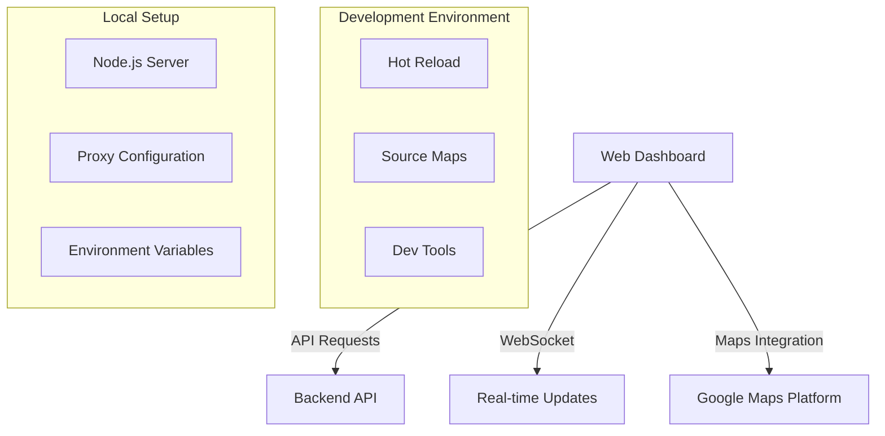
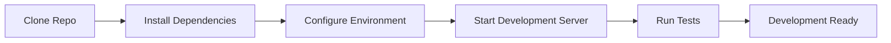

# Live Fleet Tracking System - Web Dashboard Setup Guide

## Human Tasks Checklist
- [ ] Obtain and configure Google Maps API key with proper domain restrictions
- [ ] Configure SSL certificates for API and WebSocket endpoints
- [ ] Set up secure JWT token storage with appropriate prefix
- [ ] Review environment-specific settings with infrastructure team
- [ ] Configure error reporting and monitoring services
- [ ] Set up CI/CD pipeline access and credentials

## Prerequisites

### Required Software
- Node.js >= 16.0.0
- npm >= 8.0.0
- Git
- Code Editor (recommended: VS Code)

### Required Access
- GitHub repository access
- Google Maps API key with the following enabled:
  - Maps JavaScript API
  - Directions API
  - Geocoding API
- Development environment credentials

## Installation

### 1. Repository Setup
```bash
# Clone the repository
git clone <repository-url>
cd src/web

# Install dependencies
npm install
```

### 2. Environment Configuration
```bash
# Copy environment template
cp .env.example .env

# Configure environment variables
# Edit .env file with your specific settings:
- REACT_APP_API_BASE_URL
- REACT_APP_SOCKET_URL
- REACT_APP_GOOGLE_MAPS_API_KEY
- REACT_APP_AUTH_TOKEN_KEY
- REACT_APP_ENVIRONMENT
```

### 3. Development Server Setup
```bash
# Start development server
npm start

# The application will be available at:
# http://localhost:3000
```

## Configuration

### Environment Variables

#### API Configuration
- `REACT_APP_API_BASE_URL`: Backend API endpoint
- `REACT_APP_API_VERSION`: API version (default: v1)

#### WebSocket Configuration
- `REACT_APP_SOCKET_URL`: WebSocket server URL
- `REACT_APP_SOCKET_RECONNECT_ATTEMPTS`: Reconnection attempts (default: 5)
- `REACT_APP_SOCKET_RECONNECT_DELAY`: Delay between attempts in ms (default: 3000)

#### Maps Integration
- `REACT_APP_GOOGLE_MAPS_API_KEY`: Google Maps API key
  - Ensure key is restricted to:
    - Your domain
    - Required APIs only
    - Appropriate usage quotas

#### Authentication
- `REACT_APP_AUTH_TOKEN_KEY`: JWT token storage key
- `REACT_APP_SECURE_COOKIES`: Enable secure cookies (default: true)

## Development Workflow

### Available Scripts

```bash
# Start development server
npm start

# Run tests
npm test

# Run tests with coverage
npm run test:coverage

# Build for production
npm run build

# Lint code
npm run lint

# Format code
npm run format
```

### Development Architecture



### Setup Workflow



## Testing

### Running Tests
```bash
# Run all tests
npm test

# Run tests in watch mode
npm run test:watch

# Generate coverage report
npm run test:coverage
```

### Test Configuration
- Jest configuration is included in package.json
- Test files should be placed in `__tests__` directories
- Use `.test.ts` or `.test.tsx` extensions

## Build Process

### Production Build
```bash
# Create production build
npm run build

# Output will be in the 'build' directory
```

### Build Configuration
- Optimized for production
- Minified and compressed assets
- Source maps generation
- Tree shaking enabled

## Performance Optimization

### Development Configuration
- Hot Module Replacement enabled
- Source maps for debugging
- Proxy configuration for API requests
- WebSocket connection handling
- Memory usage optimization

### Resource Utilization
- Lazy loading for routes
- Code splitting enabled
- Image optimization
- Cache management
- Service worker configuration

## Troubleshooting

### Common Issues
1. Node.js version mismatch
   - Solution: Use nvm to install correct version
   
2. Environment variables not loading
   - Solution: Ensure .env file is in correct location
   
3. WebSocket connection issues
   - Solution: Check proxy configuration and SSL settings

4. Maps not loading
   - Solution: Verify API key and restrictions

### Support Resources
- Technical Documentation: `/docs`
- API Documentation: `REACT_APP_API_DOCS_URL`
- Support Portal: `REACT_APP_SUPPORT_URL`

## Security Considerations

### Development Security
- HTTPS enforced in development
- Secure cookie configuration
- CSP headers enabled
- XSS protection measures
- CORS configuration

### API Security
- JWT token management
- Request rate limiting
- Error handling
- Secure WebSocket connections
- API key protection

## Additional Resources

### Documentation
- Component Documentation: `/docs/components.md`
- Architecture Guide: `/docs/architecture.md`
- Deployment Guide: `/docs/deployment.md`

### Version Control
- Branch naming convention: `feature/`, `bugfix/`, `hotfix/`
- Commit message format: Conventional Commits
- Pull request template available

### Code Quality
- ESLint configuration included
- Prettier formatting rules
- TypeScript strict mode enabled
- Jest test coverage requirements